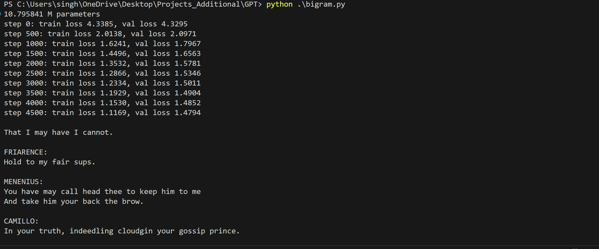
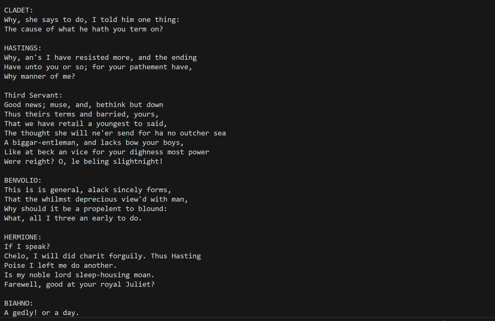

# GPT_Transformer

## Transformer-Based Character-Level Language Model

This repository contains a character-level language model implemented using the Transformer architecture, inspired by the paper ["Attention is All You Need"](https://arxiv.org/abs/1706.03762). The model is trained to predict the next character in a sequence, demonstrating the core principles of attention mechanisms in natural language processing.

## Features

This project showcases a comprehensive implementation of a Transformer-based character-level language model with the following key features:

### 1. Transformer Architecture
- **Self-Attention Mechanism**: Implements multi-head self-attention, allowing the model to weigh the importance of different characters in the sequence when making predictions. This enables the model to capture both short-term and long-term dependencies in the text.
- **Layer Normalization**: Utilizes layer normalization after each sub-layer to stabilize and accelerate training by reducing internal covariate shifts.
- **Residual Connections**: Includes skip connections (residual connections) around sub-layers (e.g., attention, feed-forward) to help with gradient flow and allow for deeper networks.

### 2. Multi-Head Attention
- **Multiple Attention Heads**: Employs several attention heads that work in parallel to focus on different parts of the input sequence simultaneously, enhancing the model’s ability to understand complex patterns and relationships within the text.
- **Scalability**: The model is designed to scale efficiently by increasing the number of attention heads and layers, making it adaptable to various sizes of datasets and model complexity.

### 3. Positional Encoding
- **Sequential Data Handling**: Since Transformers do not inherently understand the order of tokens (unlike RNNs), positional encoding is added to the input embeddings to give the model information about the position of each token in the sequence.
- **Sinusoidal Encoding**: Uses sinusoidal functions to generate positional encodings, which can generalize to sequences longer than those seen during training.

### 4. Character-Level Modeling
- **Fine-Grained Text Processing**: Operates at the character level, making it possible to model and generate detailed patterns in text, such as word formations, syntax, and even creative text structures.
- **Flexible Vocabulary**: By processing individual characters rather than words, the model can easily adapt to any language or domain without the need for predefined vocabularies or tokenization rules.

### 5. Dropout for Regularization
- **Dropout Layers**: Introduces dropout layers in the model to prevent overfitting by randomly setting a fraction of input units to zero during training. This encourages the model to generalize better to unseen data.

### 6. GPU Acceleration
- **CUDA Support**: Leverages PyTorch’s ability to utilize NVIDIA GPUs for faster training and evaluation, making it feasible to train larger models or run more iterations in a shorter amount of time.
- **Scalable Training**: The code is designed to seamlessly switch between CPU and GPU, allowing users with different hardware configurations to run the model efficiently.

### 7. Training Loop and Optimization
- **Efficient Training Loop**: Implements a robust training loop with periodic evaluation on a validation set to monitor and improve model performance over time.
- **AdamW Optimizer**: Uses the AdamW optimizer, which incorporates weight decay to help regularize the model, improving convergence and generalization.
- **Learning Rate Scheduling**: Potential to integrate learning rate scheduling techniques to adapt the learning rate during training, ensuring optimal convergence.

### 8. Text Generation Capabilities
- **Autoregressive Text Generation**: The model generates text in an autoregressive manner, predicting the next character based on the preceding context, and continuously updating the context as it generates new characters.
- **Flexible Context Size**: The model can generate text based on any initial context provided, making it versatile for creative text generation tasks.
- **Sampling Strategies**: Implements sampling techniques such as multinomial sampling from the predicted probability distribution to introduce variability in the generated text.

### 9. Evaluation Metrics
- **Loss Estimation**: Provides tools to estimate training and validation loss, helping to evaluate the model’s performance and guide hyperparameter tuning.
- **Perplexity (Optional)**: Although not included by default, the model can be easily extended to calculate perplexity, a common metric for evaluating language models.

### 10. Modular Design
- **Reusable Components**: The code is organized into modular components (e.g., data loading, model definition, training loop) that can be easily reused or adapted for other NLP tasks or models.
- **Extensible Architecture**: Designed to be easily extended or modified, whether to adjust the number of layers, heads, or to incorporate new techniques such as attention masking or beam search during generation.


## Getting Started

### Prerequisites

- Python 3.7+
- PyTorch 1.7+
- CUDA (for GPU support)

### Installation

1. Clone the repository:
   ```bash
   git clone https://github.com/yourusername/GPT_Transformer.git
   cd GPT_Transformer
   ```

### Usage

1. **Prepare the Dataset**:
   - Place your text data in the file `input.txt`. This file will be used for training the model.

2. **Train the Model**:
   - Run the training script:
     ```bash
     python bigram.py
     ```
   - The model will train on the provided dataset, periodically evaluating on a validation set.

3. **Generate Text**:
   - After training, the model can generate text sequences. Modify the `context` in `bigram.py` to start the generation with a specific seed.

### Model Architecture

The model is based on the Transformer architecture, consisting of:

- **Embedding Layer**: Maps input tokens to dense vectors.
- **Multi-Head Attention**: Enables the model to focus on different parts of the sequence simultaneously.
- **Feed-Forward Networks**: Applies non-linear transformations to the attention outputs.
- **Stacked Layers**: Multiple layers of attention and feed-forward networks to increase model capacity.

### Example

An example output after training on the Shakespeare dataset might look like this:

```
To be, or not to be, that is the question:
Whether 'tis nobler in the mind to suffer
The slings and arrows of outrageous fortune,
Or to take arms against a sea of troubles
And by opposing end them.
```

### Sample output



## Contributor
- Siddharth Singh
- sms10221@nyu.edu

### License

This project is licensed under the MIT License - see the [LICENSE](LICENSE) file for details.

### Acknowledgments

- Inspired by the "Attention is All You Need" paper by Vaswani et al.
- Thanks to the PyTorch community for the excellent tools and libraries.